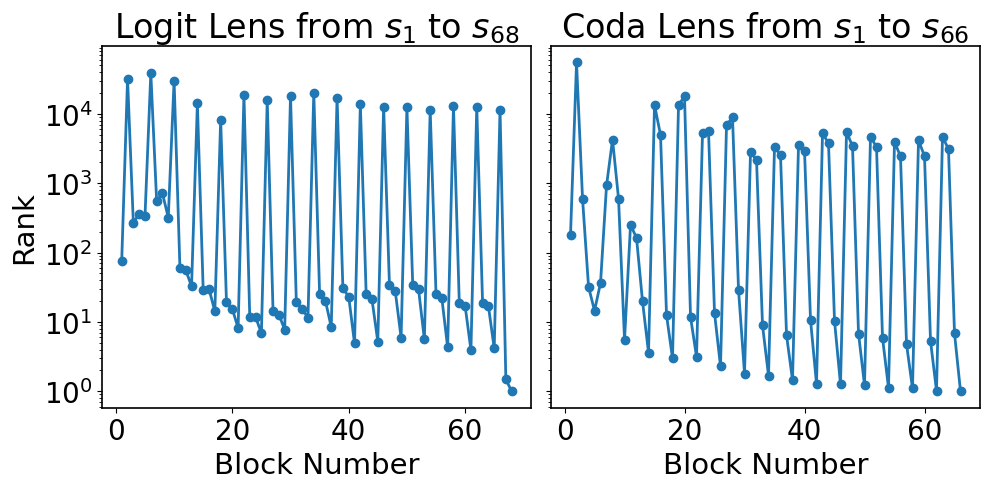
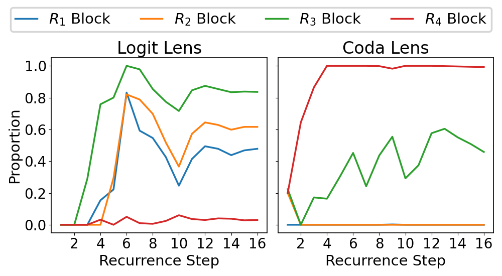
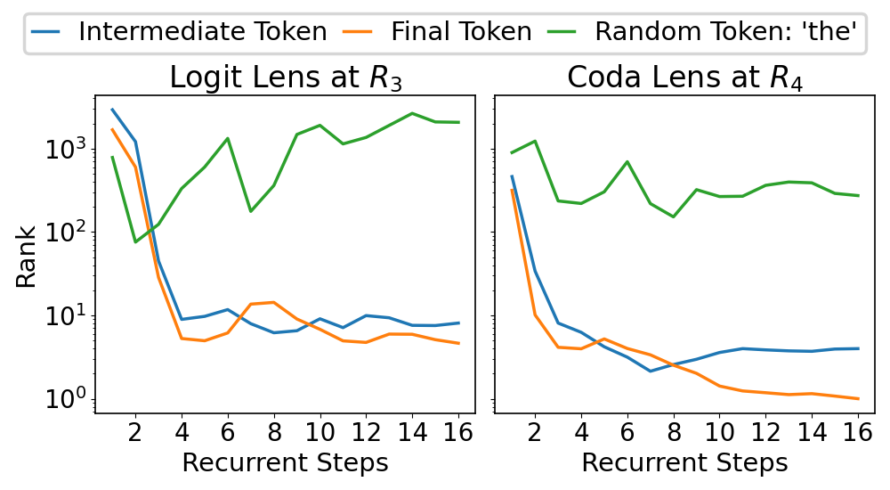

# Latent Chain-of-Thought? Decoding the Depth-Recurrent Transformer

## Introduction
Chain-of-thought (CoT) reasoning has enabled transformer-based language models to excel at complex mathematics and multi-step planning. However, in standard decoder-only architectures, these reasoning steps are externalized in natural language, improving interpretability at the cost of efficiency. To capture reasoning that are not easily represented in words, many works have explored recurrent architectures that aim to internalize reasoning in latent space, potentially supporting latent CoT. In this paper, we investigate whether such reasoning structures emerge in Huginn-3.5B, a depth-recurrent Transformer that reuses layers at inference time without increasing parameter count. We examine the model’s internal behavior on arithmetic tasks using a suite of probing techniques including the Logit Lens and Coda Lens. Our findings reveal limited evidence of interpretable latent CoT by tracking rank trajectories of final and intermediate result tokens. Furthermore, we uncover significant probing inconsistencies across recurrent blocks, where the interpretability of hidden states depends heavily on both the layer index and the decoding method. Finally, we empirically show that increasing recurrence depth yields only marginal gains and falls well short of models that explicitly externalize reasoning steps.

## Experiments
### Get Started
First download weights *.safetensors from [this link](https://huggingface.co/tomg-group-umd/huginn-0125/commit/2a364bd96e3eaa831be324f7c1f9e74892e4e594) to huginn-predrank/ and huginn-trace/ .

### We dicover significant discontinuities in hidden space interpretability in depth recurrent transformer.
<p align="center">


</p>

Compute rank trajectory of predicted token via logit lens, also compute the top-5 tokens decoded from each layer via logit lens:
```shell
python logit_lens_exp.py
```

Compute rank trajectory of predicted token via coda lens, also compute the top-5 tokens decoded from each layer via coda lens:
```shell
python coda_lens_exp.py
```

Visualize graph for rank trajectory: 
```shell
python unrolled_rank_comparison.py
```

Visualize graph for proportion of top-5 tokens that are signed numeric prefixes: 
```shell
python frequency_analysis_combined.py
```


### We trace the rank trajectory of the intermediate and final result tokens in one-digit composite arithmetic task, but find little evidence for latent CoT.

<p align="center">

</p>

We first filter the dataset to the subset that the models answers correctly and have single-digit answer:
```shell
python filter_dataset.py 
```

Compute rank trajectories for intermediate, final result tokens and a random 'the' token decoded via logit lens
```shell
python logit_lens_exp_inter.py
```

Compute rank trajectories for intermediate, final result tokens and a random 'the' token decoded via coda lens
```shell
python coda_lens_exp_inter.py
```

Visualize the graph for rank trajectories of intermediate, final result tokens
```shell
python rank_analysis_inter_combined.py
```


### We benchmark Huginn's performance on GSM8k dataset under the condition of suppressing explicit CoT. The conclusion is we still NEED explicit CoT reasoning to achieve optimal performance!

To be consistent with original Huginn paper, we use lm_eval to conduct evaluation on GSM8k, and use the checkpoint [tomg-group-umd/huginn_swa_100_10_avg_0.9_merge](https://huggingface.co/tomg-group-umd/huginn_swa_75_7_ema_0.9_merge/tree/main). We use the following command for evaluation. Note that we edit the original YAML configuration with our system prompt and delete the reasoning processes in the 8-shot CoT prompting.

```shell
accelerate launch --num_processes 1 -m lm_eval   --model hf   --model_args pretrained=tomg-group-umd/huginn_swa_100_10_avg_0.9_merge,trust_remote_code=True,dtype=bfloat16,mean_recurrence=128   
--tasks gsm8k_stan   --include_path ./lm_eval/tasks/gsm8k   --batch_size 1   --num_fewshot 8  --output_path outputs/gsm8k_re128   --fewshot_as_multiturn   --apply_chat_template=True   --system_instruction="You are a concise and helpful assistant. Always return only the final answer straightway." --log_samples
```
